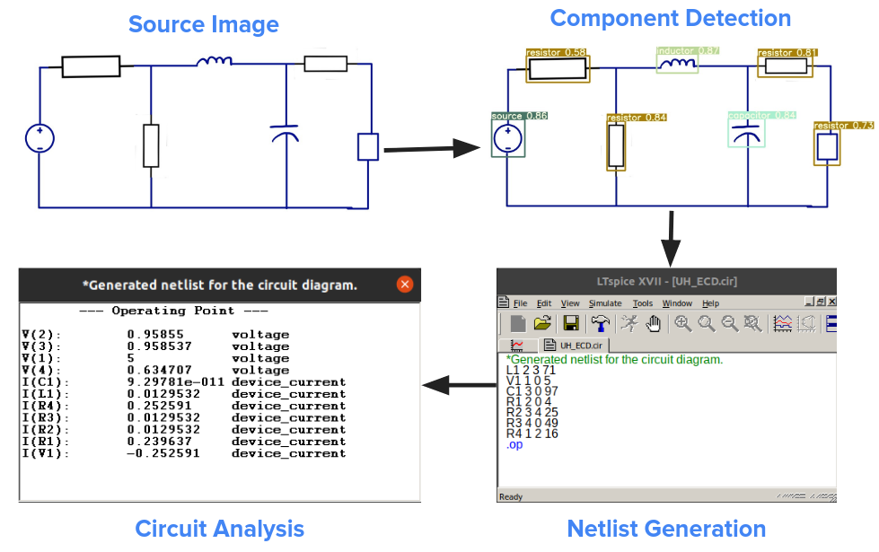

## Instructions to run the project
Step 1: Clone the project -> `git clone --recursive https://github.com/Varat7v2/PROJECT-ECD.git` \
Step 2: Intsall required packages -> `pip install -r requirements.txt` \
Step 3: Run the main program ->`python PEDApp_main.py`

## Description of the project
This project has been trained on both TensorFlow (SSD MobileNet V2) and PyTorch (YOLOV5 and YOLOR) frameworks. For training the model, dataset have been prepared by ourselves and then annotated. Trained on YOLOR weights till 300 epcochs, model accuracy of 91% is achieved.

## Results

<video width="320" height="240" controls>
  <source src="buck_converter_simulation-2023-05-10_01.04.13.mp4" type="video/mp4">
</video>
